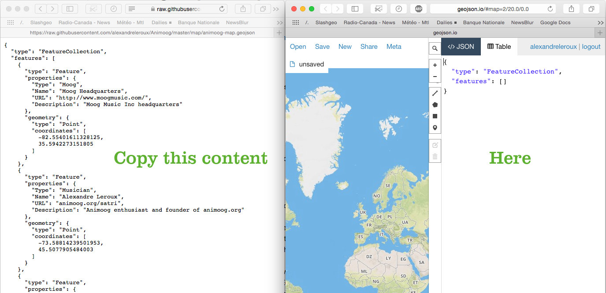
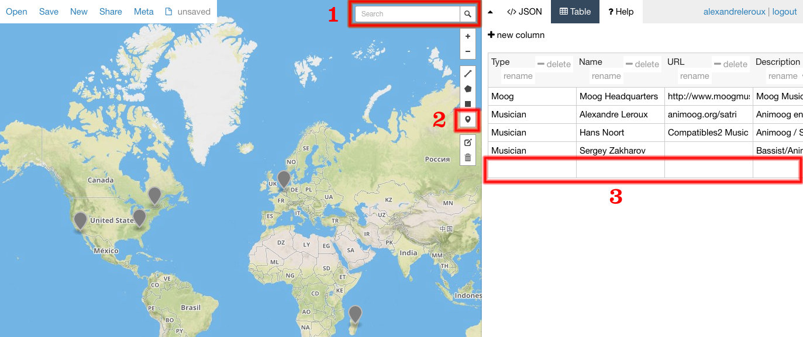
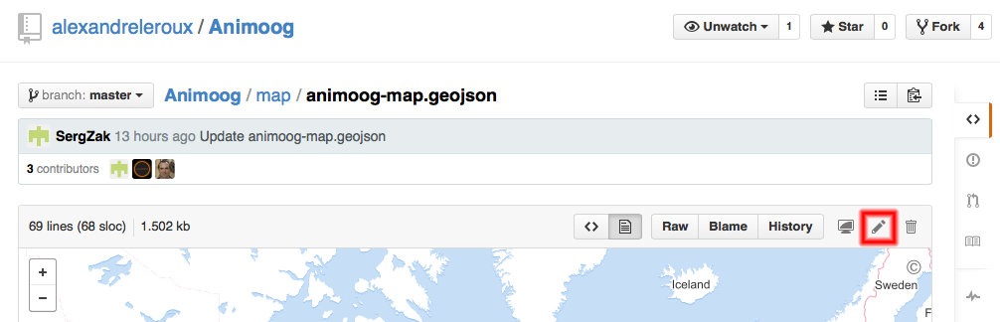
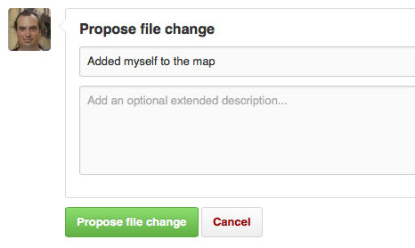
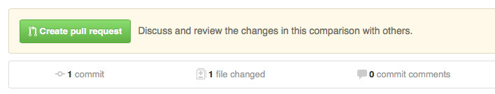

# The Apptronica Maps

Welcome fellow iOS music enthusiast! In this section of the repository you'll find two interactive maps and their associated open data:

1. The [iOS Music World Map](iOS-Music-World-Map.geojson), displaying the major stakeholders of the world of iOS music on an interactive map. It includes iOS app developers, iOS-compatible hardware manufacturers, and more (UPCOMING)
2. The [Apptronica Members Map](members-map.geojson), showing iOS musicians publishing under [the Apptronica label](http://apptronica.co.uk), Apptronica members are welcomed to contribute to it

Everybody is welcomed to contribute! Here's the instructions and guidelines.

# I want to see the maps!

That's easy! Click on the geojson file and GitHub will display it interactively. Try it yourself:

1. The [iOS Music World Map](iOS-Music-World-Map.geojson)
2. The [Apptronica Members Map](members-map.geojson)

# Providing feedback and more

* You have great ideas to improve this map? [Let us know in the issues](https://github.com/alexandreleroux/Apptronica/issues)!
* You play Animoog? Head [here for the Animoog players map](https://github.com/alexandreleroux/Animoog)!
* And my shameless plug, I'm an Animoog soloist part of the Apptronica label, my [albums of improvized Animoog solos are available for free](http://animoog.org/satri), it got good reviews and even made it to the Moog Music frontpage

# Instructions for Contributing to the Maps

Everyone is welcomed to contribute to the maps as long as you follow its spirit and the following rules

## Guidelines for the iOS Music World Map

In order to have consistent map, we need to agree on some rules as to what is displayed on the map to maintain it's usefulness. Anyone can [propose amendments to those guidelines](https://github.com/alexandreleroux/Apptronica/issues).

Here's the categories and their associated symbols and colors:

* iOS Music App Developers
 * App developers use the 'mobilephone' icon  in the dark blue color (#0000FF)
 * The developers must have published or updated an iOS music app in the past two years
 * The pushpin is the location of their headquarters, or the office in charge of developing the iOS music app
 * iOS musical instruments as well as other apps that are obviously related to iOS music creation are allowed

* iOS Music Hardware Manufacturers
 * Hardware manufacturers use the 'industrial' symbol  in the orange color
 * Location of their headquarters or office in charge of the product
 * Must be currently manufacturing and shipping iOS-compatible music hardware
 * Location of distributors is not allowed

* iOS Music Artists
 * iOS Music Artists use the 'music' notes icon  in the green color (#32CD32)
 * Can be a registered music label as long as it is at least 80% devoted to pure iOS music
 * Can be an recognized artist with at least a full album of pure iOS music. By 'recognized artist' we mean an artist able to live from his iOS music creation revenues. If you have a better rule to identify which iOS music artists should be on this map, [let's discuss](https://github.com/alexandreleroux/Apptronica/issues)!

You have ideas pertaining to other categories that should be represented on the map? [Let us know](https://github.com/alexandreleroux/Apptronica/issues)! The map uses the <a href="https://www.mapbox.com/maki/" target="_blank">Maki symbols</a> which can be directly displayed on GitHub. 

## Adding a pushpin to the map

Map data can be stored in a GeoJSON file and <a href="https://help.github.com/articles/mapping-geojson-files-on-github" target="_blank">automatically displayed over a map on GitHub</a>. Note that the screenshots below showcase the [Animoog Players Map](https://github.com/alexandreleroux/Animoog), but the steps to follow remain the same.

Adding a pushpin to the file that contains the map data:

1. Register and login to <a href="http://github.com" target="_blank">GitHub</a> - this step is necessary to avoid spam on the map
2. In a second browser tab, open the <a href="http://geojson.io" target="_blank">geojson.io</a> website
3. Copy the <a href="https://raw.githubusercontent.com/alexandreleroux/Apptronica/master/maps/iOS-Music-World-Map.geojson" target="_blank">raw iOS-Music-World-Map.geojson</a> content to the geojson.io website in its '</> JSON' tab 
4. Click on the 'Table' tab to edit the map content using the 'Table' view:
  1. Add new pushpins by searching for its location (the magnifying glass icon) and then clicking the pushpin to place the marker on the map
  2. Add corresponding text and links in the Table view 
5. Go to the <a href="https://github.com/alexandreleroux/Apptronica/master/maps/iOS-Music-World-Map.geojson" target="_blank">iOS-Music-World-Map.geojson file</a> page and click 'Edit this file' (the little pen icon), copy your improved geojson from the '</> JSON' tab on geojson.io and copy this content to iOS-Music-World-Map.geojson on GitHub 
6. Indicate what you added or changed in the 'Propose file change' box and click the 'Propose file change' button 
7. On the 'Comparing changes' page that loaded, click on 'Create pull request' 

Bravo, you're done! Once I'll accept your changes (usually within a few days at most), the map will be updated and all other players will see the improvements you've done.

## Privacy warning

* Make certain you publish public coordinates to the map. If for instance you're adding your home on the map (e.g. as an App developer), don't use the precise location such as putting the pushpin directly on your house, favor the neighborhood instead. In other words: you are responsible for the accuracy of the coordinates you publish and the associated privacy
